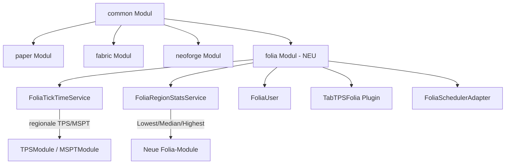

# TabTPS Folia-Support Plan

## Zusammenfassung

Folia ist ein Fork von Paper, der das Minecraft-Server-Modell grundlegend ändert: Statt eines globalen Tick-Loops tickt jede **Region** separat auf einem eigenen Thread. Das bedeutet:

- Es gibt **keine globale TPS/MSPT** mehr
- Jede Region hat ihre **eigene TPS und MSPT**
- `Bukkit.getTPS()` und `Bukkit.getAverageTickTime()` existieren nicht auf Folia
- Tasks müssen über Folia-spezifische Scheduler laufen

### Ziel

Ein neues `folia/` Gradle-Modul, das:
1. **Regionale TPS/MSPT** anzeigt (die Region, in der sich der Spieler befindet)
2. **Zusätzliche Module** bereitstellt: `lowest_region_tps`, `median_region_tps`, `highest_region_tps`
3. Alle bestehenden Display-Typen unterstützt (Tab, ActionBar, BossBar)

---

## Architektur-Übersicht



---

## Phase 1: Common-Modul Anpassungen

### 1.1 TickTimeService erweitern

**Datei:** `common/src/main/java/xyz/jpenilla/tabtps/common/service/TickTimeService.java`

Das Interface muss um kontextabhängige Methoden erweitert werden. Die `default`-Implementierungen sorgen für Rückwärtskompatibilität:

```java
public interface TickTimeService {
  double averageMspt();
  double[] recentTps();

  // Neu: Spieler-kontextabhängige Methoden
  default double averageMspt(User<?> user) {
    return averageMspt();
  }

  default double[] recentTps(User<?> user) {
    return recentTps();
  }

  default double displayTps(User<?> user) {
    final double[] recentTps = this.recentTps(user);
    if (recentTps.length == 3) {
      return recentTps[0];
    }
    return recentTps[1];
  }

  default double displayTps() {
    final double[] recentTps = this.recentTps();
    if (recentTps.length == 3) {
      return recentTps[0];
    }
    return recentTps[1];
  }
}
```

### 1.2 TPSModule und MSPTModule User-aware machen

**Datei:** `common/src/main/java/xyz/jpenilla/tabtps/common/module/TPSModule.java`

Aktuell ruft TPSModule `this.tabTPS.platform().tickTimeService().displayTps()` ohne User-Kontext auf. Da der User bereits beim Erstellen der Module im ModuleRenderer durchgereicht wird, muss das Modul den User speichern und nutzen:

```java
public final class TPSModule extends AbstractModule {
  private final @Nullable User<?> user;

  public TPSModule(TabTPS tabTPS, Theme theme) {
    this(tabTPS, theme, null);
  }

  public TPSModule(TabTPS tabTPS, Theme theme, @Nullable User<?> user) {
    super(tabTPS, theme);
    this.user = user;
  }

  @Override
  public Component display() {
    double tps = this.user != null
      ? this.tabTPS.platform().tickTimeService().displayTps(this.user)
      : this.tabTPS.platform().tickTimeService().displayTps();
    return TPSUtil.coloredTps(tps, this.theme.colorScheme());
  }
}
```

Analog für **MSPTModule**.

### 1.3 ModuleType-Registry anpassen

**Datei:** `common/src/main/java/xyz/jpenilla/tabtps/common/module/ModuleType.java`

- TPS und MSPT Module-Factories so ändern, dass sie den User (optional) durchreichen
- Neue ModuleTypes für Folia-spezifische Module registrieren (können optional sein, werden nur registriert wenn Folia erkannt wird)

### 1.4 Neue Folia-spezifische Module im Common-Modul

Neue Module die von der Plattform bereitgestellt werden können:

| Modul-Name | Klasse | Beschreibung |
|---|---|---|
| `lowest_region_tps` | `LowestRegionTPSModule` | Niedrigste TPS aller aktiven Regionen |
| `median_region_tps` | `MedianRegionTPSModule` | Median-TPS aller aktiven Regionen |
| `highest_region_tps` | `HighestRegionTPSModule` | Höchste TPS aller aktiven Regionen |

Diese Module benötigen ein neues Interface:

```java
public interface RegionStatsService {
  double lowestRegionTps();
  double medianRegionTps();
  double highestRegionTps();
}
```

Die Plattform stellt diesen Service optional bereit:

```java
// In TabTPSPlatform
default @Nullable RegionStatsService regionStatsService() {
  return null;
}
```

---

## Phase 2: Folia-Modul Grundgerüst

### 2.1 Gradle-Konfiguration

**Neue Dateien:**

- `folia/build.gradle.kts` - Ähnlich wie paper, aber mit Folia-API Dependency
- `settings.gradle.kts` - `folia` zum Modul-Array hinzufügen

```kotlin
// folia/build.gradle.kts
plugins {
  id("tabtps.platform.shadow")
}

dependencies {
  implementation(projects.tabtpsCommon)
  compileOnly("dev.folia:folia-api:1.20.4-R0.1-SNAPSHOT")
  // Alternativ: Paper API mit Folia-Additions
  implementation(libs.cloudPaper)
  implementation(libs.bstatsBukkit)
  implementation(libs.slf4jJdk14)
}
```

### 2.2 Verzeichnisstruktur

```
folia/
├── build.gradle.kts
└── src/main/
    ├── java/xyz/jpenilla/tabtps/folia/
    │   ├── TabTPSFolia.java              # Plugin-Hauptklasse
    │   ├── FoliaUser.java                # Folia-spezifischer User
    │   ├── command/
    │   │   ├── FoliaConsoleCommander.java
    │   │   ├── FoliaPingCommand.java
    │   │   └── FoliaTickInfoCommandFormatter.java
    │   ├── service/
    │   │   ├── FoliaTickTimeService.java  # Regionaler TickTimeService
    │   │   ├── FoliaRegionStatsService.java
    │   │   └── FoliaUserService.java
    │   └── util/
    │       └── FoliaSchedulerAdapter.java
    └── resources/
        └── plugin.yml
```

---

## Phase 3: Folia-Modul Implementierung

### 3.1 FoliaTickTimeService

**Datei:** `folia/src/main/java/xyz/jpenilla/tabtps/folia/service/FoliaTickTimeService.java`

Diese Klasse ist das Kernstück des Folia-Supports:

```java
public final class FoliaTickTimeService implements TickTimeService {

  // Globale Fallback-Werte, falls kein User-Kontext verfügbar
  @Override
  public double averageMspt() {
    return 0; // Kein globaler Wert auf Folia
  }

  @Override
  public double[] recentTps() {
    return new double[]{20.0, 20.0, 20.0}; // Fallback
  }

  // Regionale Werte basierend auf der Spieler-Region
  @Override
  public double averageMspt(User<?> user) {
    // Spieler-Location ermitteln
    // Region des Spielers finden
    // Tick-Daten der Region auslesen via Reflection/API
  }

  @Override
  public double[] recentTps(User<?> user) {
    // Regionale TPS auslesen
  }
}
```

**Technische Details zum Zugriff auf regionale Tick-Daten:**

Folia speichert regionale Tick-Daten intern in `ThreadedRegionizer.ThreadedRegion`. Der Zugriff erfolgt über:

1. `RegionizedServer.getInstance()` - Zugriff auf den regionalisierten Server
2. Spieler → Welt → Chunk → Region Mapping
3. `TickRegionData` der Region enthält die Tick-Zeiten

Da Folia keine stabile public API für regionale Tick-Daten hat, muss der Zugriff via **Reflection/MethodHandles** erfolgen, ähnlich wie `PaperTickInfoCommandFormatter` es bereits für Paper macht.

### 3.2 FoliaRegionStatsService

**Datei:** `folia/src/main/java/xyz/jpenilla/tabtps/folia/service/FoliaRegionStatsService.java`

```java
public final class FoliaRegionStatsService implements RegionStatsService {
  // Iteriert über alle aktiven Regionen
  // Sammelt TPS-Werte aller Regionen
  // Berechnet Lowest, Median, Highest

  @Override
  public double lowestRegionTps() { ... }

  @Override
  public double medianRegionTps() { ... }

  @Override
  public double highestRegionTps() { ... }
}
```

### 3.3 TabTPSFolia - Plugin-Hauptklasse

**Datei:** `folia/src/main/java/xyz/jpenilla/tabtps/folia/TabTPSFolia.java`

Ähnlich wie `TabTPSPlugin` im Paper-Modul, aber:
- Verwendet Folia-Scheduler statt `BukkitScheduler`
- Initialisiert `FoliaTickTimeService` und `FoliaRegionStatsService`
- Registriert Folia-spezifische Module

```java
public final class TabTPSFolia extends JavaPlugin implements TabTPSPlatform<Player, FoliaUser> {
  private FoliaTickTimeService tickTimeService;
  private FoliaRegionStatsService regionStatsService;

  @Override
  public void onEnable() {
    this.tickTimeService = new FoliaTickTimeService();
    this.regionStatsService = new FoliaRegionStatsService();
    // ... Initialisierung analog zu TabTPSPlugin
  }

  @Override
  public RegionStatsService regionStatsService() {
    return this.regionStatsService;
  }
}
```

### 3.4 FoliaUser

**Datei:** `folia/src/main/java/xyz/jpenilla/tabtps/folia/FoliaUser.java`

Sehr ähnlich zu `BukkitUser`, da Folia die meisten Paper-APIs behält:

```java
public final class FoliaUser extends AbstractUser<Player> {
  // Identisch zu BukkitUser, kann eventuell auch direkt davon erben
  // oder gemeinsamen Code in eine shared Klasse extrahieren
}
```

### 3.5 FoliaSchedulerAdapter

**Datei:** `folia/src/main/java/xyz/jpenilla/tabtps/folia/util/FoliaSchedulerAdapter.java`

Da `TabTPS` einen `ScheduledExecutorService` verwendet, der Display-Updates periodisch ausführt, und dieser auf Folia weiterhin funktioniert (Paket-Senden ist thread-safe), muss der Scheduler nicht komplett ersetzt werden.

Allerdings müssen andere Stellen, die `BukkitScheduler` verwenden, angepasst werden:

```java
// Statt:
getServer().getScheduler().runTaskAsynchronously(...)
// Muss auf Folia:
getServer().getAsyncScheduler().runNow(plugin, task -> { ... });
```

### 3.6 FoliaTickInfoCommandFormatter

**Datei:** `folia/src/main/java/xyz/jpenilla/tabtps/folia/command/FoliaTickInfoCommandFormatter.java`

Angepasster Formatter der regionale Tick-Informationen anzeigt, inklusive:
- TPS/MSPT der aktuellen Region des Ausführenden
- Lowest/Median/Highest Region TPS als Zusammenfassung

### 3.7 plugin.yml für Folia

```yaml
name: TabTPS
version: ${version}
main: xyz.jpenilla.tabtps.folia.TabTPSFolia
api-version: "1.19"
folia-supported: true
description: ${description}
```

---

## Phase 4: Display-System Anpassungen

### 4.1 DisplayHandler Scheduler-Kompatibilität

Der aktuelle `DisplayHandler` nutzt `tabTPS.executor()` (einen Java `ScheduledExecutorService`). Dieser funktioniert auch auf Folia, da:
- Adventure-Paket-Senden ist thread-safe
- Die Display-Tasks lesen nur Daten und senden Pakete

**Keine Änderung am DisplayHandler nötig**, solange der `FoliaTickTimeService` thread-safe auf die regionalen Daten zugreift.

### 4.2 BossBarDisplayTask Anpassung

Der `BossBarDisplayTask` greift direkt auf `platform().tickTimeService()` zu für den Progress-Balken. Da die User-kontextabhängigen Methoden als `default`-Methoden hinzugefügt werden, muss hier der User durchgereicht werden:

```java
// Statt:
this.tabTPS.platform().tickTimeService().averageMspt()
// Wird:
this.tabTPS.platform().tickTimeService().averageMspt(this.user)
```

---

## Phase 5: Konfiguration

### 5.1 Neue Module in der Display-Konfiguration

Die neuen Folia-Module können in den Display-Configs verwendet werden:

```hocon
actionBarSettings {
  modules = "tps, mspt, ping, lowest_region_tps"
}

tabSettings {
  headerModules = "median_region_tps"
  footerModules = "tps, mspt, lowest_region_tps, highest_region_tps"
}
```

### 5.2 Graceful Degradation

Wenn die Folia-spezifischen Module auf einer nicht-Folia-Plattform in der Konfiguration stehen, sollten sie entweder:
- Ignoriert werden mit einer Warnung im Log
- Oder erst gar nicht in der ModuleType-Registry registriert werden

---

## Zusammenfassung der zu ändernden/erstellenden Dateien

### Common-Modul - Änderungen

| Datei | Änderung |
|---|---|
| `TickTimeService.java` | User-kontextabhängige `default`-Methoden hinzufügen |
| `TPSModule.java` | Optional User-Kontext nutzen für regionale TPS |
| `MSPTModule.java` | Optional User-Kontext nutzen für regionale MSPT |
| `ModuleType.java` | TPSModule/MSPTModule Factories anpassen, neue Module registrieren |
| `BossBarDisplayTask.java` | User-Kontext an TickTimeService durchreichen |

### Common-Modul - Neue Dateien

| Datei | Beschreibung |
|---|---|
| `RegionStatsService.java` | Interface für Lowest/Median/Highest Region TPS |
| `LowestRegionTPSModule.java` | Modul für niedrigste Regions-TPS |
| `MedianRegionTPSModule.java` | Modul für Median-Regions-TPS |
| `HighestRegionTPSModule.java` | Modul für höchste Regions-TPS |

### Folia-Modul - Neue Dateien

| Datei | Beschreibung |
|---|---|
| `folia/build.gradle.kts` | Gradle Build-Konfiguration |
| `TabTPSFolia.java` | Plugin-Hauptklasse |
| `FoliaUser.java` | Folia-spezifischer User |
| `FoliaTickTimeService.java` | Regionaler TickTimeService |
| `FoliaRegionStatsService.java` | Lowest/Median/Highest Region Stats |
| `FoliaUserService.java` | User-Verwaltung |
| `FoliaConsoleCommander.java` | Konsolen-Commander |
| `FoliaPingCommand.java` | Ping-Command |
| `FoliaTickInfoCommandFormatter.java` | TickInfo-Formatter mit regionalen Daten |
| `FoliaSchedulerAdapter.java` | Folia-Scheduler-Utilities |
| `plugin.yml` | Plugin-Beschreibung mit folia-supported: true |

### Build-System

| Datei | Änderung |
|---|---|
| `settings.gradle.kts` | `folia` zum Modul-Array hinzufügen |
| `gradle/libs.versions.toml` | Folia-API Version hinzufügen |

### Plattform-Interface

| Datei | Änderung |
|---|---|
| `TabTPSPlatform.java` | Optional `regionStatsService()` Methode hinzufügen |

---

## Risiken und Offene Punkte

1. **Folia-API Stabilität**: Folia hat keine stabile API für regionale Tick-Daten. Zugriff muss über Reflection erfolgen, was bei Updates brechen kann.
2. **Thread-Safety**: Zugriff auf regionale Tick-Daten muss thread-safe sein, da Display-Updates auf separaten Threads laufen.
3. **Region-Wechsel**: Wenn ein Spieler die Region wechselt, müssen die angezeigten Werte nahtlos wechseln.
4. **Konsolen-Kommandos**: Konsolen-Befehle wie `/tickinfo` haben keinen Spieler-Kontext - hier sollte eine Zusammenfassung aller Regionen angezeigt werden.
5. **Code-Duplikation mit Paper**: `FoliaUser`, `FoliaConsoleCommander` etc. werden sehr ähnlich zu ihren Paper-Gegenstücken sein. Optional könnte man ein gemeinsames `paper-common` Submodul erstellen.
